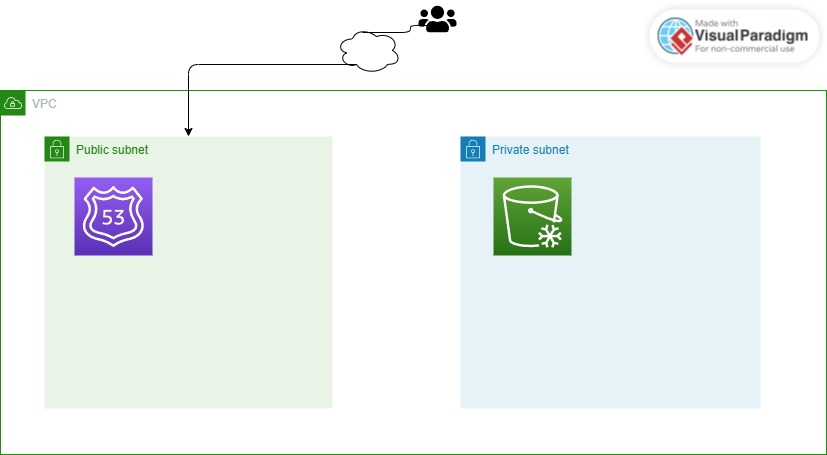

# AWS First Project

## Objective
Document my first AWS cloud architecture project.

## Architecture

## Services Shown
- User
- Internet
- Route 53
- Amazon S3

## What I Learned
- DNS helps users reach cloud resources using domain names.
- Route 53 manages DNS records in AWS.
- S3 can host static website files.
- Cloud projects should be documented with diagrams and explanations.

## Future Improvements
- Add CloudFront
- Add HTTPS with ACM
- Add a real static website
- Add deployment steps
